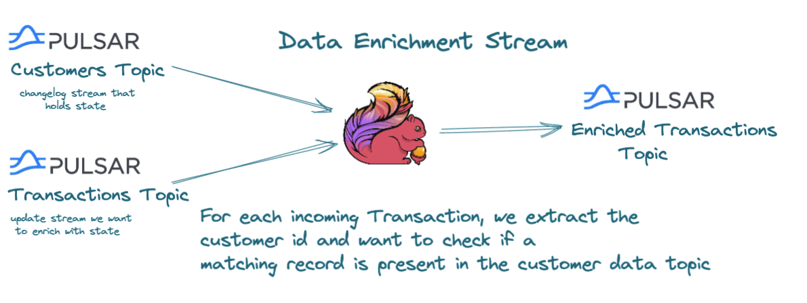

<p align="center">
    
</p>

### Table of Contents
1. [Environment Setup](#environment-setup)
2. [Warmup - Connecting to Pulsar](#warmup)
3. [Handling Multiple Streams](#handling-multiple-streams)
4. [Warmup - Keyed State](#keyed-state)
5. [Performing Data Enrichment and Lookups](#data-enrichment-and-lookups)
6. [Buffering](#buffering)
7. [Side Outputs](#side-outputs)
8. [State Backends](#state-backends)
9. [Checkpoints, Savepoints and Restart Strategies](#checkpoints-savepoints-and-restart-strategies)
10. [Additional Resources](#additional-resources)

### Environment Setup
In order to run the code samples we will need a Pulsar and Flink cluster up and running.
You can also run the Flink examples from within your favorite IDE in which case you don't need a Flink Cluster.

If you want to run the examples inside a Flink Cluster run to start the Pulsar and Flink clusters.
```shell
docker-compose up
```

if you want to run within your IDE you can just spin up a pulsar cluster
```shell
docker-compose up pulsar
```

When the cluster is up and running successfully run the following command:
```shell
./setup.sh
```

### Warmup
**Outcomes:** How can we connect to Pulsar and start consuming events.
We will see how we can achieve this by using:
1. [The Datastream API](src/main/java/io/ipolyzos/compute/source/datastream)
2. [The Flink SQL API](src/main/java/io/ipolyzos/compute/source/sql)

### Handling Multiple Streams
**Use Case:**  
In some scenarios you might need to **merge** multiple streams together, for example data from two pulsar topics.  
The input topics events can either the same or different schemas.
When the input events have the same schema you can use the **union** function, otherwise you can use the **connect** function. 

<p align="center">
    
</p>

**Outcome:**  
We will how to achieve this using two input transaction topics - one containing **credit** transactions and one with **debits** and **merge** these two
streams into one datastream. We will see two different approaches:
* [Union Function:](src/main/java/io/ipolyzos/compute/mutlistreams) Input datastreams need to be of the same input data type
* [Connect Function:](src/main/java/io/ipolyzos/compute/mutlistreams) Input datastreams to be of different types

Other options to explore:
* [Window Joins](https://nightlies.apache.org/flink/flink-docs-release-1.15/docs/dev/datastream/operators/joining/#window-join)
  * the events need to belong to the same window and match on some join condition
* [Interval Joins](https://nightlies.apache.org/flink/flink-docs-release-1.15/docs/dev/datastream/operators/joining/#interval-join) 
  * the events need to be between the same interval  
  
  > **lowerBoundInterval < timeA - timeB < upperBoundInterval**


### Keyed State
<p align="center">
    
</p>

**Outcomes:**  
1. Understand the difference between **Operator State** and **Keyed State**
2. How Flink handles state and the available State primitives  

We will review with an example that accumulates state per customer key and calculates: **How many transactions we have per customer?**  
**You can find the relevant examples** [here](src/main/java/io/ipolyzos/compute/state)

### Data Enrichment and Lookups
<p align="center">
    
</p>

**Use Case:**  
In some scenarios we need to be able to perform **Data Enrichment** and/or **Data Lookups** having on topic as an 
**append-only stream** while the other topic is a **changelog** stream - keeps only the latest state for a particular key.  
We will see how to implement such use cases by using Flink's combining Flink's process function and Keyed State to enrich 
transaction events with user information.  
**You can find the relevant examples** [here](src/main/java/io/ipolyzos/compute/enrichment).

### Buffering
**Use Case:**
This scenario is pretty similar to the previous one, but here we are buffering the events when there is some missing state.  
We can not guarantee when both matching events will arrive into our system and in such case we might want to buffer the events
until a matching one arrives.  
**You can find the relevant examples** [here](src/main/java/io/ipolyzos/compute/buffering).

### Side Outputs
**Use Case:**  
Some scenarios you might want to split one stream into multiple streams - **stream branches** - and forward
them to different downstream operators for further processing.  
We will see how to implement such a use cases in order to account for **unhappy paths**. Following our **Data Enrichment** example, we will see
how to handle transaction events for which user information is not present (maybe due to some human error or system malfunction).  
**You can find the relevant examples** [here](src/main/java/io/ipolyzos/compute/sideoutputs).

### State Backends
**Outcomes:**
- Understand Flink State backends
- Use RocksDB as the state backend to handle state that can't fit in memory

### Checkpoints, Savepoints and Restart Strategies
**Outcomes:**
- Understand how Flink's Checkpointing mechanism works
- Understand how we can combine Flink checkpoints and Restart Strategies to recover our job
- Checkpoints vs Savepoints 
- How we can recover state from a previous checkpoint  
**You can find the relevant examples** [here](src/main/java/io/ipolyzos/compute/fault_tolerance).

### Additional Resources
* [Flink Checkpoints Principles and Practices: Flink Advanced Tutorialsv](https://www.alibabacloud.com/blog/flink-checkpoints-principles-and-practices-flink-advanced-tutorials_596631https://www.alibabacloud.com/blog/flink-checkpoints-principles-and-practices-flink-advanced-tutorials_596631)
* [Here’s How Apache Flink Stores Your State data](https://towardsdatascience.com/heres-how-flink-stores-your-state-7b37fbb60e1a)
* [Choosing the correct Flink Restart Strategy](https://kartikiyer.com/2019/05/26/choosing-the-correct-flink-restart-strategy-avoiding-production-gotchas/)
* [Best Practices and Tips for Working with Flink State: Flink Advanced Tutorials](https://www.alibabacloud.com/blog/best-practices-and-tips-for-working-with-flink-state-flink-advanced-tutorials_596630?spm=a2c65.11461447.0.0.19252ffbl4Nuva)
