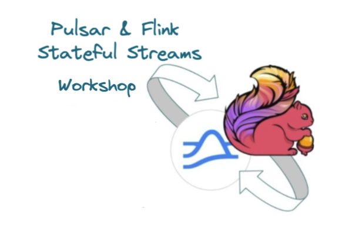

<p align="center">
    
</p>

### Environment Setup
In order to run the code samples we will need a Pulsar and Flink cluster up and running.
You can also run the Flink examples from within your favorite IDE in which case you don't need a Flink Cluster.

If you want to run the examples inside a Flink Cluster run to start the Pulsar and Flink clusters.
```shell
docker-compose up
```

if you want to run within your IDE you can just spin up a pulsar cluster
```shell
docker-compose up pulsar
```

When the cluster is up and running successfully run the following command:
```shell
./setup.sh
```

this script will create all the required topics and policies needed for the provided examples.

### Table of Contents
1. [Warmup - Connecting to Pulsar](#warmup)
2. [Handling Multiple Streams](#handling-multiple-streams)
3. [Warmup - Keyed State](#keyed-state)
4. [Performing Data Enrichment and Lookups](#data-enrichment-and-lookups)
5. [Side Outputs](#side-outputs)
6. [State Backends](#state-backends)
7. [Checkpoints](#checkpoints)

### Warmup
**Outcomes:** How can we connect to Pulsar and start consuming events.
We will see how we can achieve this by using:
1. [The Datastream API](src/main/java/io/ipolyzos/compute/source/datastream) 
2. [The Flink SQL API](src/main/java/io/ipolyzos/compute/source/sql)

### Handling Multiple Streams
**Use Case:** In some scenarios you might need to **merge** multiple streams together, for example data from two pulsar topics.
The input topics events can either the same or different schemas.
When the input events have the same schema you can use the **union** function, otherwise you can use the **connect** function.
**Outcome:** We will how to achieve this using two input transaction topics - one containing **credit** transactions and one with **debits** and **merge** these two
streams into one datastream. We will see two different approaches:
* **Union Function:** Input datastreams need to be of the same input data type
* **Connect Function:** Input datastreams to be of different types

You can find the relevant examples [here](src/main/java/io/ipolyzos/compute/mutlistreams)

Extra to explore:
* [Window Joins](https://nightlies.apache.org/flink/flink-docs-release-1.15/docs/dev/datastream/operators/joining/#window-join)
  * the events need to belong to the same window and match on some join condition
* [Interval Joins](https://nightlies.apache.org/flink/flink-docs-release-1.15/docs/dev/datastream/operators/joining/#interval-join) 
  * the events need to be between the same interval, i.e **lowerBoundInterval < timeA - timeB < upperBoundInterval**


### Keyed State
**Use Case**

### Data Enrichment and Lookups
**Use Case**

### Side Outputs
**Use Case**

### State Backends
**Use Case**

### Checkpoints
**Use Case**
